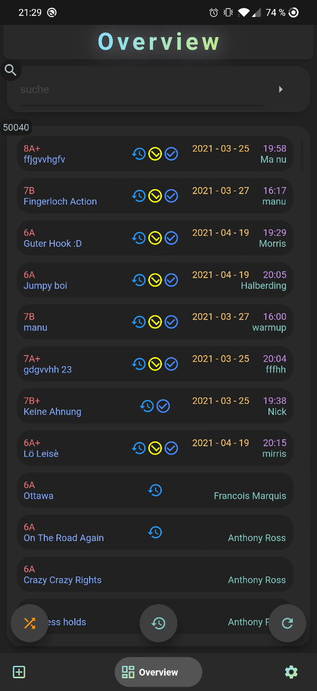
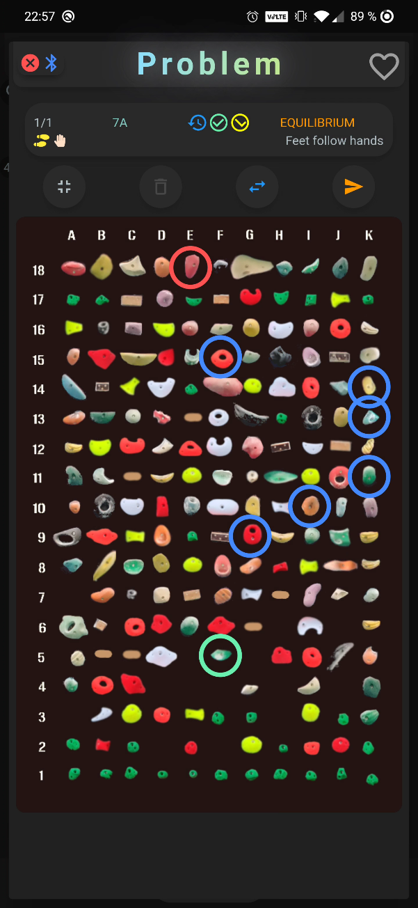
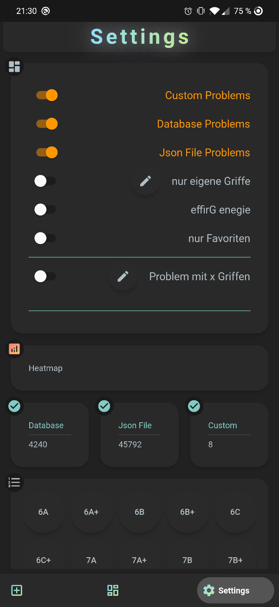
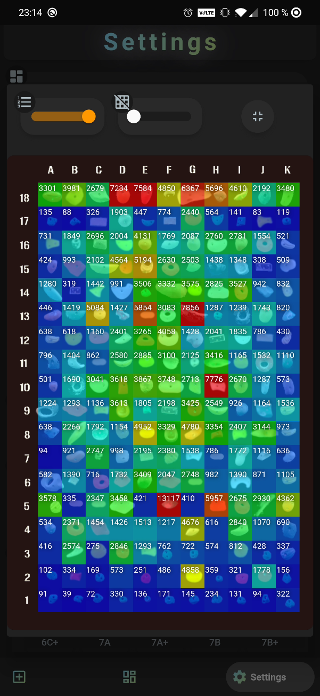
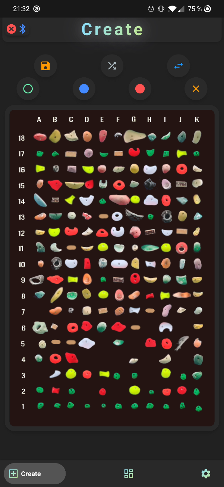
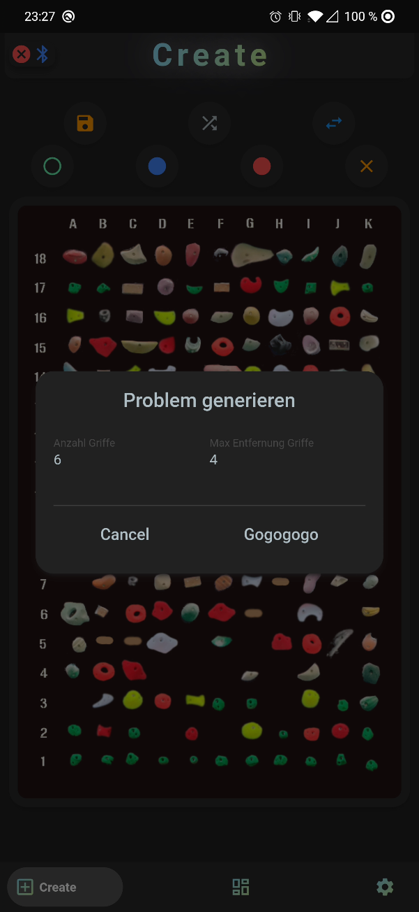
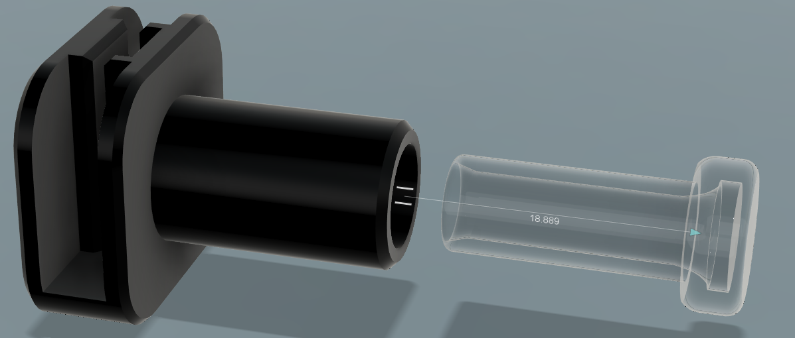
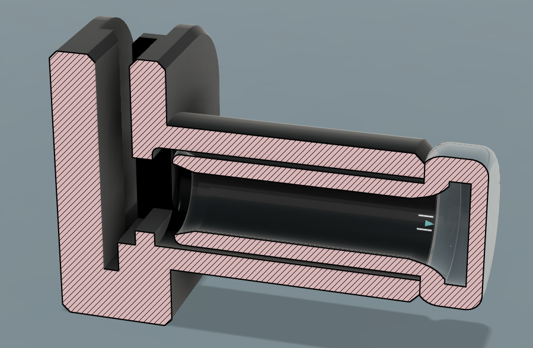

# Awesome Board

Eine Digitalisierte Boulderwand um Boulderrouten zu speichern
und diese während des kletterns an der Wand visuell wiederzugeben

## Vorraussetung

Eine bereits vorhandene Kletterwand zuhause :D

## benötigte Teile für das LED "Upgrade" an der Wand

- 198 addresiebare LEDs [WS2812B](https://www.amazon.de/BTF-LIGHTING-WS2812B-300LEDs-Streifen-NichtWasserdicht/dp/B01CDTEJBG/ref=sr_1_1_sspa?__mk_de_DE=%C3%85M%C3%85%C5%BD%C3%95%C3%91&dchild=1&keywords=ws2812b&qid=1619131764&sr=8-1-spons&psc=1&spLa=ZW5jcnlwdGVkUXVhbGlmaWVyPUExVTU5V0k4VDdVVzhHJmVuY3J5cHRlZElkPUEwMjc4MjQ4MlRUWFdOQktaWkRQQyZlbmNyeXB0ZWRBZElkPUEwMjUyMzA0MlZFQ1hVRUk0QVlVOSZ3aWRnZXROYW1lPXNwX2F0ZiZhY3Rpb249Y2xpY2tSZWRpcmVjdCZkb05vdExvZ0NsaWNrPXRydWU=)
  - 198, weil an der Wand insgesamt 198 Griffe (18 x 11) angebracht werden können und somit jeder Griff eine eigene LED unter sich hat.
  - Ich habe hier einen kompletten LED streifen genommen, da es billiger war, als z.B. 198 einzelne LEDs zu kaufen
  - Die LEDs von dem Streifen kann man sich dann einfach einzeln abschneiden
- 198 x plastik Gehäuse für die LEDs um diese "in" der Kletterwand zu montieren
  - ein Gehäuse für diese LEDs gibt es nicht zu kaufen, daher hab ich eins selber konstruiert und anschließend mit einem 3D Drucker gedruckt (_Bilder dazu weiter unten_)
- 3 adriges Kabel zum verbinden aller LEDs [LAPP UNITRONIC® LiYCY 3 x 0,75 | ca.50m](https://www.lappkabel.de/produkte/online-kataloge-shop/datenuebertragungssysteme/datenleitungen-niederfrequenz/din-farbcode/unitronic-liycy.html)
  - Ich brauchte hier ca. 50 Meter da jede LED ungefähr 25cm von einander entfernt ist
  - Bei einer Matrix von _18 x 11 = 198_ Griffe brauch ich daher _198 x 0,25m = 49,5m ~ 50m_
- Mikrocontroller zur Steuerung [ESP32](https://www.amazon.de/AZDelivery-Development-unverl%C3%B6tet-inklusive-Nachfolger/dp/B08BTS62L7/ref=sr_1_4?__mk_de_DE=%C3%85M%C3%85%C5%BD%C3%95%C3%91&dchild=1&keywords=esp32&qid=1619131886&sr=8-4)
- geeignets [Netzteil](https://www.amazon.de/CHINLY-LED-Treiber-Transformator-Stromversorgung-LED-Leiste/dp/B01LZF6NK6/ref=sr_1_8?__mk_de_DE=%C3%85M%C3%85%C5%BD%C3%95%C3%91&dchild=1&keywords=5v+20a&qid=1619133575&sr=8-8) für die LEDs und dem ESP32
  - eine LED verbraucht auf voller Helligkeit und Weiß ca. 60mA
  - theoretisch bräuchte ich also ein Netzteil, welches mind. 11.88A( 198 \* 60mA ) bei 5V liefert um alle LEDs auf voller Helligkeit gleichzeitig am leuchten zu haben
  - der ESP32 verbraucht nur ca. 50-150mA
- irgendein wasserdichtes Gehäuse um die Elektronik dort zu verstauen, da die Kletterwand in unserem Fall draußen steht

#

## **Projekt-Komponenten**

#

### **Android/iOS App**

Ein Teil von dem Projekt ist die App zur Steuerung der LEDs an der Wand und die vorhandenen Routen zu verwalten/filtern.

#### **Features der App**

- Übersicht aller vorhandenen Routen
- Erstellung eigener Routen
- Filtern der vorhanen Routen
- Spiegeln von Routen
- Verlauf von bereits probierten Routen
- Routen als Favoriten markieren

#### **Entwicklungsumgebung**

Für die Entwicklung der App wurde das Framework [Flutter]() von Google genutzt.
Als Editor [Visual Studio Code]() von Microsoft

### **Mikrocontroller/LEDs**

Der andere Teil vom Projekt ist der Mikrocontroller welcher an der Kletterwand angebracht ist um die einzelnen LEDs anzusteuern. Der Mirkocontroller verfügt über Bluetooth, damit dieser mit einem Smartphone kommunizieren kann.

Als Mikrocontroller habe ich den ESP32 verwendet, da dieser bereits onboard über bluetooth verfügt

Mikrocontroller Git repository [AwesomeBoardBluetooth](http://github.com/manuu10/Monnboard_Bluetooth)

#### **Entwicklungsumgebung**

Für die Entwicklung auf dem Mikrocontroller wurde Visual Studio Code genutzt mit der Extension "Platform IO" um Arduino basierte Boards zu programmieren

#

# **Übersicht der App**

### **_Hauptübersicht_**

auf der Seite sind alle Probleme aufgelistet.

##

Tippt man auf eines der Probleme öffnet sich die Übersicht für das Problem.
Auf der sieht man dann, welche Griffe für die Route benutzt werden dürfen
Die unterschiedlichen Farben um den Griffen bedeuten in dem Fall:

- Grün -> Startgriff
- Blau -> Zwischengriffe
- Rot -> Endgriffe

Die Icons oben in der Mitte von links nach rechts:

- Problem ist bereits in der Historie
- alle angegeben Griffe sind auf der kletterwand vorhanden
- alle angegeben Griffe sind gespiegelt auf der kletterwand vorhanden

#

### **_Einstellungsseite_**

auf der Seite können die Einstellung der App vorgenommen werden.
In der obersten Box können Filter angewendet werden, für die Problemübersicht in der Hauptübersicht.

- nur eigene Griffe
  - filtert die Probleme auf Griffe welche benutzerdefiniert angegeben wurden
- effirG enegie
  - filtert auf das gleich wie **_nur eigene Griffe_** nur in dem Fall gespiegelt
- über die **Heatmap**(2. Abbildung) kann angesehen werden wie oft welcher Griff benutzt wird

#

### **_Eigenes Problem erstellen_**

über diese Seite kannst du deine eigenen Boulderrouten erstellen.
Man kann oben seine Griffart auswählen und anschließend auf die gewünschten Griffe einfach tippen.

##

Man kann zudem auch noch eine Zufallsroute von der App erstellen lassen. als Parameter kann man angeben wie viele Griffe man haben möchte und wie weit jeder von einander entfernt sein darf (2. Abbildung)

#

# **Weitere Bilder zu dem Projekt**

## 3D Modell von dem Gehäuse für die LEDs

Das Gehäuse für die Leds um diese in der Wand zu montieren.

##

Das schwarze Teil ist das wo die Led eingelegt wird und das transparente wird von vorne mit rein geschoben um die LEDs zu schützen

## Hier folgen noch weitere Bilder/Videos von der Wand in Aktion, allerdings muss ich diese noch aufnehmen.
